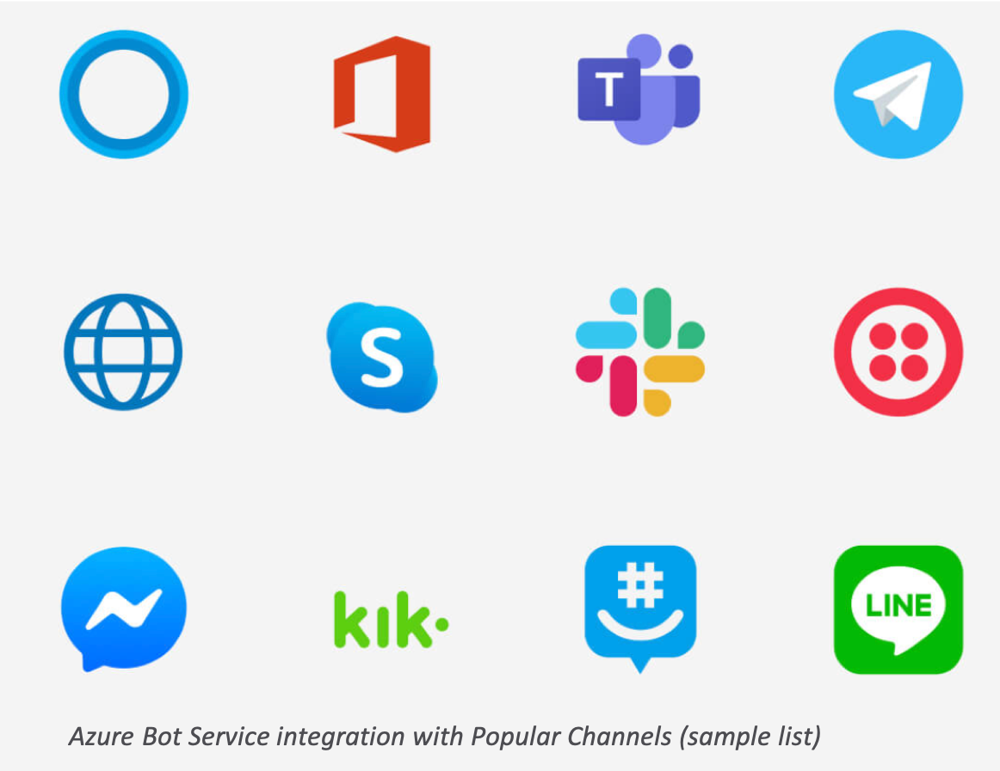
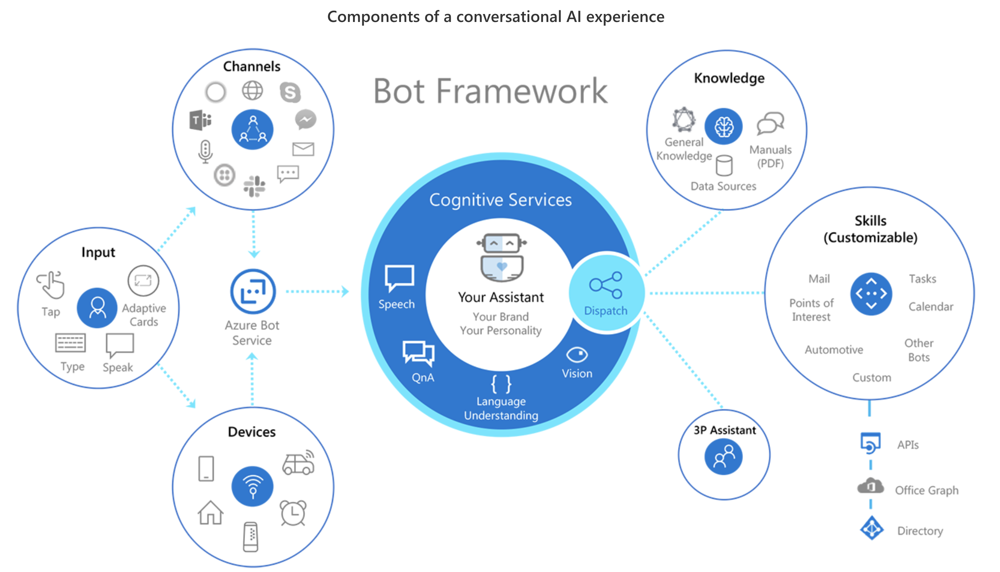

# Chapter: Ishan Mishra sp20-516-238

## Azure Bot Services Overview

Azure Bot Service provides an integrated environment that is purpose-built for bot development, enabling developer to build, connect, test, deploy, and manage intelligent bots, all from one place. Azure Bot Service leverages the Bot Framework SDK with support for C#, JavaScript, Python and Java. Through the use of modular and extensible framework provided by the SDK, tools, templates, and AI services developers can create bots that use speech, understand natural language, handle questions and answers, and more.[@sp20-516-238-azure-bot-service-overview]

The service can be added to websites, apps, email, GroupMe, Facebook Messenger, Kik, Skype, Slack, Microsoft Teams, Telegram, SMS, Twilio, Cortana, Skype for Business and more. (see @fig:azure-bot-service-channels, for sample list of such channels)

{#fig:azure-bot-service-channels}

## What is a bot?

Bots provide an experience that feels less like using a computer and more like dealing with a person or an intelligent robot. Bots can be used to shift simple, repetitive tasks, such as taking a dinner reservation or gathering profile information, on to automated systems that may no longer require direct human intervention. Users converse with a bot using text, interactive cards, and speech. A bot interaction can be a quick question and answer, or it can be a sophisticated conversation that intelligently provides access to services.

Bots are a lot like modern web applications, living on the internet and use APIs to send and receive messages. Modern bot software relies on a stack of technology and tools to deliver increasingly complex experiences on a wide variety of platforms. However, a simple bot could just receive a message and echo it back to the user with very little code involved.

Bots can do the same things other types of software can do - read and write files, use databases and APIs, and do the regular computational tasks. What makes bots unique is their use of mechanisms generally reserved for human-to-human communication.

## Applications

Azure Bot Framework provides a set of templates, solution accelerators and skills to help build sophisticated conversational experiences.[@sp20-516-238-bot-framework-sdk] (see @fig:azure-bot-framework)

* **Virtual Assistant**

Various organizations have significant need to deliver a conversational assistant tailored to their brand, personalized to their users, and made available across a broad range of canvases and devices.

* **Skills**

A library of re-usable conversational skill building-blocks that enables to add functionality to a Bot. Currently, the offered services include Calendar, Email, Task, Point of Interest, Automotive, Weather and News skills.

* **Analytics**

Gain key insights into deployed bot’s health and behavior with the Bot Framework Analytics solutions, which includes: sample Application Insights queries, and Power BI dashboards to understand the full breadth of bot’s conversations with users.

Azure Bot Service offers powerful AI capabilities with Azure Cognitive Services [@sp20-516-238-azure-cognitive], such as:

* **Language Understanding**

A machine learning-based service to build natural language experiences. Quickly create enterprise-ready, custom models that continuously improve. Language Understanding Service(LUIS) allows your application to understand what a person wants in their own words.

* **QnA Maker**

QnA Maker is a cloud-based API service that creates a conversational, question-and-answer layer over your data. With QnA Maker, you can build, train and publish a simple question and answer bot based on FAQ URLs, structured documents, product manuals or editorial content in minutes.

* **Dispatch**

Dispatch tool lets you build language models that allow you to dispatch between disparate components (such as QnA, LUIS and custom code).

* **Speech Services**

Speech Services convert audio to text, perform speech translation and text-to-speech with the unified Speech services. With the speech services, you can integrate speech into your bot, create custom wake words, and author in multiple languages.

* **Adaptive Cards**

Adaptive Cards are an open standard for developers to exchange card content in a common and consistent way, and are used by Bot Framework developers to create great cross-channel conversational experiences.

{#fig:azure-bot-framework}
