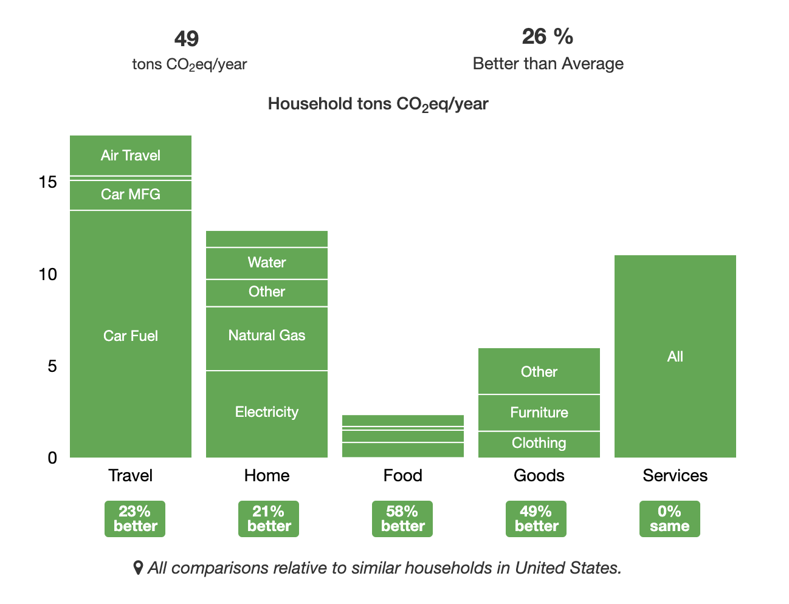

# Data Center Assignment  SP20_516_238

## Exercise 2 : Data Center - Carbon Emission & Yearly Cost

## Exercise 3 : My Own Carbon footprint

**Calculator**: <https://coolclimate.berkeley.edu/calculator>

**My own carbon footprint**: 49 tons CO2/eq per yer (98000 pounds)

{#fig:my-own-carbon-footprint}

## Exercise 4: Hydro Power: Renewed through natural water cycle

To meet the high power demand from data centers and to minimize the carbon emission, hydro power is a great choice.

In simple terms, hydro power starts with with energy from the sun. The heat from sun causes water to evaporate and form the clouds after condensation. Clouds are blown about by the wind and when the droplets and ice crystals that form clouds become too heavy, they fall back onto the ground as rain or snow. The water then flows through the rivers, and generating stations harness this cycle to produce electricity.

{#fig:natural-hydro-power-cycle} 

### Vantage Data Centers - Québec City Data Center Campus, Québec, Canada

Vantage data centers is a leading provider of co-located data centers solutions in North America. Their largest data center in Canada is located at Québec City. With 21MW capacity upon complete development, the data center utilizes nearly 100% hydroelectric power, which creates very little greenhouse gas and no harmful waste to the environment.

#### References

* <http://www.hydroquebec.com/about/our-energy.html>

* <https://vantage-dc.com/data_centers/quebec-city-data-center-campus/>

## Exercise 5: Québec, Canada - Utilizing green, reliable and affordable energy

With its cool climate, a geographical location that protects it from natural disasters like major earthquakes, and abundant, affordable sources of energy, Québec has become an ideal location for data centers.

Québec province in Canada is the largest producer of hydropower in Canada, with an installed capacity of 36.9 GW and a storage capacity of 176 TWh. Hydropower accounts for 99.8% of all energy produced in Québec and Hydro-Québec is the largest hydropower producer, which transmits and distributes electricity to most of the data centers in the region.

In 2015, the electricity produced in Québec accounted for 32% of Canada’s total power generated from all sources, but was responsible for only 1% of GHG emissions linked to electric utilities.

Overall, GHG emissions from Québec hydropower (run-of-river generating stations and generating stations with reservoirs) are similar to those from wind, five times lower than those from photovoltaic solar, 50 times lower than those from natural gas-fired plants and 70 times lower than those from coal-fired plants.

Today Québec is not only home for data centers from major providers like Google, AWS, IBM but also for many co-located data center providers like Vantage, Cologix.

#### References

* <http://www.hydroquebec.com/about/our-energy.html>

* <https://www.investquebec.com/international/en/industries/information-and-communication-technologies/data-centres.html>

## Exercise 8: Facebook Data Center Outage in March 2019

In March 2019, Facebook suffered it's worst outage in a decade. The 14-hour outage affected millions of its users and advertisers around the world. Services including Messenger, Instagram, WhatsApp and Facebook Workplace went down during this outage. Many other services that use Facebook credentials were unable to authorize user login and were impacted during this period. 

*   **Date:** March 13th 2019
*   **Data Center:**  Facebook
*   **Category:** Configuration Error
*   **Description:** Due to server configuration changes
*   **Duration:**  > 14 hours
*   **Impact:** Large. More than 2 billion people impacted.
*   **Estimate Cost Impact:** Approximately $80-90 million (based on the figures reported by Facebook)

#### References

* <https://www.datacenterknowledge.com/facebook/facebook-instagram-outage-spreads-users-around-globe>

* <https://www.tsg.com/blog/business-strategy/how-much-did-facebook-outage-really-cost>
