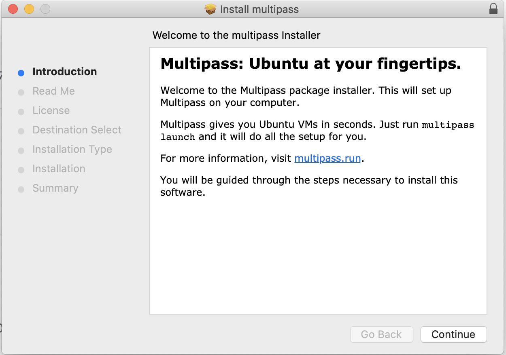
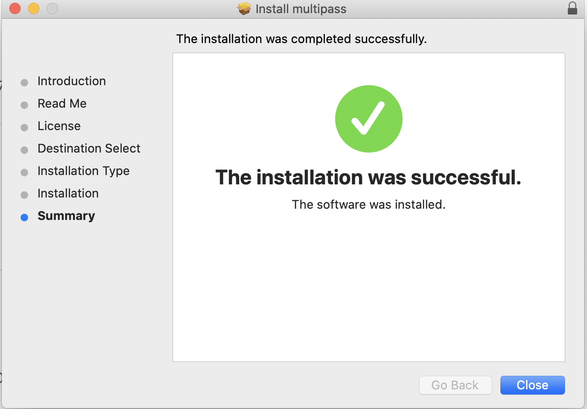

# Multipass Assignment for week 2

## Exercise: E.Multipass.1

### Multipass Installation Instruction for MacOS

It is recommended to conduct a package based install for MacOS. Click at: <https://github.com/canonical/multipass/releases/download/v1.0.0/multipass-1.0.0%2Bmac-Darwin.pkg> 
to download the multipass installation package.

 After the package is downloaded, double-click on the package to start the installation.
 
 {#fig:start-mulitpass-install}
 
 Follow the instruction on the wizard to complete the installation. After successful completion following message is displayed:
 
 {#fig:complete-multipass-install}
 
### Installation Verification

* Verify multipass version
 
```
$ multipass version

multipass  1.0.0+mac
multipassd 1.0.0+mac
```
 
* Run multipass help

```
$ multipass help    

Usage: multipass [options] <command>
Create, control and connect to Ubuntu instances.

This is a command line utility for multipass, a
service that manages Ubuntu instances.

Options:
  -h, --help     Display this help
  -v, --verbose  Increase logging verbosity, repeat up to three times for more
                 detail

Available commands:
  delete    Delete instances
  exec      Run a command on an instance
  find      Display available images to create instances from
  get       Get a configuration setting
  help      Display help about a command
  info      Display information about instances
  launch    Create and start an Ubuntu instance
  list      List all available instances
  mount     Mount a local directory in the instance
  purge     Purge all deleted instances permanently
  recover   Recover deleted instances
  restart   Restart instances
  set       Set a configuration setting
  shell     Open a shell on a running instance
  start     Start instances
  stop      Stop running instances
  suspend   Suspend running instances
  transfer  Transfer files between the host and instances
  umount    Unmount a directory from an instance
  version   Show version details

```

* Launch multipass instance

```
$ multipass launch --name ubuntu-lts

Launched: ubuntu-lts 
```

* Verify running instance info

```
$ multipass info --all

Name:           ubuntu-lts
State:          Running
IPv4:           192.168.64.3
Release:        Ubuntu 18.04.3 LTS
Image hash:     a720c34066dc (Ubuntu 18.04 LTS)
Load:           0.00 0.00 0.00
Disk usage:     999.1M out of 4.7G
Memory usage:   72.2M out of 985.7M
``` 
 

## Exercise: E.Multipass.5

### List of images supported on MacOS: using hyperkit

```
$ multipass find

Image                   Aliases           Version          Description
snapcraft:core          core16            20200115         Snapcraft builder for Core 16
snapcraft:core18                          20200115         Snapcraft builder for Core 18
16.04                   xenial            20200108         Ubuntu 16.04 LTS
18.04                   bionic,lts        20200107         Ubuntu 18.04 LTS
```